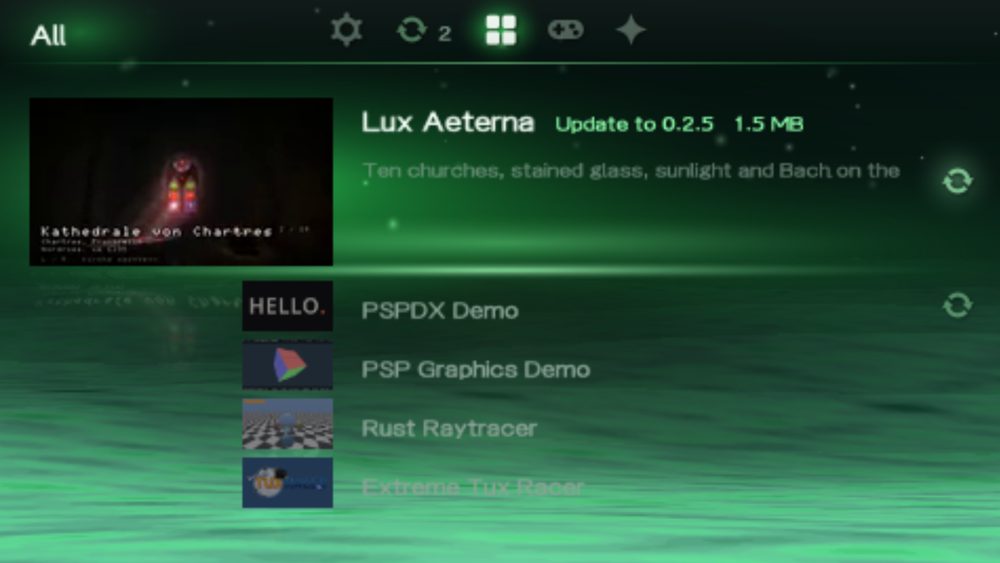

# PSPDX

**PSP Download Index** — browse, install, run and update homebrew directly
on your PlayStation Portable. **[→ Download PSPDX](https://github.com/chriopter/pspdx/releases/latest)**

PSPDX is a homebrew downloader app built around an open file format.
The reference catalog comes preconfigured, so you can start browsing right away.
Anyone can share apps or publish a catalog. Each `.pspdx` points to the
original source, so downloads and updates remain independent of any catalog.



## Why?

PSP homebrew is scattered across repositories and websites. I wanted to
browse and update it on the PSP without depending on another catalog
staying maintained.

With PSPDX, catalogs handle discovery and authors keep control of their
releases. Once an app is added, the PSP knows where to check for updates —
even if the catalog disappears.

- **[Downloader app](https://github.com/chriopter/pspdx/releases/latest)** — install, run and update homebrew on your PSP.
- **[Reference catalog](https://github.com/chriopter/pspdx-catalog)** — [browse apps](https://chriopter.github.io/pspdx-catalog/); or build your own catalog.
- **[Demo app](https://github.com/chriopter/pspdx-demo)** — a complete example for homebrew authors.

## The PSPDX client

PSPDX App lets you browse, install, run and update homebrew on your PSP.
Add `.pspdx` files through INBOX, subscribe to catalogs or enter a GitHub
repository URL; installed apps retain their source for future updates.

<details>
<summary>Connection — TLS 1.3 and GitHub requests</summary>

The client uses wolfSSL for TLS 1.3, with bundled CA certificates, certificate
chain and hostname verification, and X25519 preferred for key exchange.
The analog-stick entropy sweep and saved seed feed its random generator.
Certificate date checks are currently bypassed to tolerate an unset PSP clock;
other certificate verification failures are rejected.

A catalog supplies release metadata for many apps in one HTTP request.
Direct source checks read manifests from `raw.githubusercontent.com` and
release metadata from `api.github.com`; release downloads can redirect to
GitHub's asset hosts. Each request currently opens its own connection:
HTTP keep-alive and connection reuse are not implemented.

Synchronization runs in the background. Media work pauses while another
operation needs the shared networking stack. There are no package signatures;
adding a source means trusting it.

</details>

<details>
<summary>PSPDX processing — import, installation and files</summary>

Copy `.pspdx` files into `PSP/PSPDX/INBOX/` and select **Read INBOX** in
settings. The client validates each file, including its source and installation
directory, and asks once before installing the valid apps in sequence.
Conflicting files are skipped. Successful files leave INBOX; failed or skipped
files remain. Hold Circle to stop before the next package. Self-updates run last.

Each release must contain one ZIP with one `EBOOT.PBP`. The client checks the
download size, SHA-256 when supplied, ZIP integrity and paths, then installs
the EBOOT's directory and its contents into `installdir`. Existing unmanaged
folders are not overwritten.

A journal covers the package, manifest and installation state. Staging and
backup folders remain beside the destination because PSP directory renames
operate within one parent. Recovery touches only the journal's own paths.


**×** installs or updates; **△** opens app options; **○** goes back;
**□** adds or removes an app from the basket; **START** runs an installed app.
The shoulders and left/right switch tabs. Settings includes catalog refresh,
INBOX import, adding catalogs or repositories, and checking original sources.

The emulator key mapping is in `dev/ppsspp/controls.ini`. `dev/start` installs
it: × S, ○ D, □ A, △ W, START Enter, SELECT Space, L Q, R E;
arrows for the d-pad and I/J/K/L for the analog stick.

PSPDX uses the storage device it started from (`ms0:` or `ef0:`):

```

Each installed app keeps its original `.pspdx`. `state.json` stores:

```text
<App-ID>
├── source                      # Repository identity for the local record
├── added_from                  # Catalog URL, repository URL, or INBOX
├── installed
│   ├── version
│   ├── published_at
│   └── installdir              # Actual installation directory
└── latest
    ├── version
    ├── published_at
    ├── download_url
    ├── size
    ├── sha256                  # When available
    ├── checked_at
    └── checked_from            # Catalog or original repository
```

`installed` records what is on the stick; `latest` records the last known
release and where and when it was checked. The original `.pspdx` retains the
app's source independently of the catalog it was found in.

Old database and cache files are not migrated or automatically removed.
Existing homebrew is not adopted merely because its directory matches.

</details>

<details>
<summary>Catalogs — connection attempts, fallback and offline use</summary>

A catalog can also extract icons, background images, video and sound from
release EBOOTs and host them as previews. The reference catalog does this
automatically, so the PSP can show apps before downloading their packages.

Use **Add catalog** for an HTTPS `catalog.json` URL, or **Add GitHub
repository** for a repository URL or `owner/repo`. A new source is checked
before it is saved in `sources.txt`. Text lists remain supported, and the
app starts with the reference list configured.

The client first reads its configured sources and uses available catalog
entries. If a catalog is unreachable or invalid, its last usable local copy
remains available. Installed apps without fresh catalog information are
checked directly at their saved GitHub source. **Check original sources**
also bypasses a reachable catalog.

If GitHub fails too, the previous release information stays available and
its successful check time is not advanced. Offline browsing uses cached
catalogs and locally stored installed-app records; a saved result is the
last known release, not proof that the app is current.

Catalog and media caches can be deleted without losing installed-app tracking.

</details>

<details>
<summary>Media — catalog previews and installed EBOOTs</summary>

When browsing a catalog, the client loads icons and selected-app previews
from its media URLs and caches them in `PSP/PSPDX/CACHE/media/`. The reference
catalog extracts these from each release's EBOOT: `ICON0.PNG` (icon),
`PIC1.PNG` (background), `ICON1.PMF` (video) and `SND0.AT3` (sound).
Browsing does not require downloading each app's ZIP.

Apps added directly through a repository URL or INBOX do not fetch separate
previews from GitHub. Before installation, they use any available cached
media or a placeholder. Once installed, icons and previews are read from
the app's own `EBOOT.PBP`; local EBOOT media also takes priority for apps
installed through a catalog.

All media is optional. Missing images use the default presentation; missing
video or sound simply does not play. Offline browsing uses installed EBOOTs
and media already in the cache.

</details>

## The PSPDX standard

Publish a `.pspdx` in your repository to make your homebrew available to
PSPDX; the [demo app](https://github.com/chriopter/pspdx-demo) is a complete example.

```json
{
  "schema":     "https://github.com/chriopter/pspdx/blob/master/schema/v1.pspdx",
  "source":     "https://github.com/chriopter/psp-cathedral",
  "name":       "Lux Aeterna",
  "author":     "chriopter",
  "summary":    "Ten churches, and the sun through their glass.",
  "category":   "demo",
  "license":    "BSD-3-Clause",
  "installdir": "PSP/GAME/Cathedral"
}
```

<a id="format-specification"></a>

<details>
<summary>Format specification — fields, releases and catalogs</summary>

Required: `schema`, `source`, `name`, `category`, `installdir`. Other fields
default to repository metadata. Releases provide versions and downloads;
the EBOOT provides media. Authors need not edit the file for every release.

Version 1 supports GitHub repositories with a root `.pspdx` and a published
release containing exactly one ZIP with exactly one `EBOOT.PBP`.

[Manifest schema](schema/v1.pspdx) · [Catalog schema](schema/catalog-v1.json)

The root `.pspdx` is JSON and identifies its version through `schema`.
The [v1 schema](schema/v1.pspdx) defines the fields and rejects unknown ones.

| Field | Rule | Default if omitted |
|---|---|---|
| `schema` | Required; the exact v1 schema URL | — |
| `source` | Required; an HTTPS GitHub repository URL | — |
| `name` | Required; 1–39 characters | — |
| `category` | Required; `game`, `emulator`, `app`, `plugin` or `demo` | — |
| `installdir` | Required; `PSP/GAME/` followed by 1–32 letters, digits, dots, underscores or hyphens; not `.` or `..` | — |
| `author` | Up to 39 characters | Repository owner |
| `summary` | Up to 60 characters | Repository description |
| `license` | SPDX identifier, up to 64 characters | Repository license metadata |

Version 1 installs only under `PSP/GAME/`. A plugin requiring `seplugins`
and changes to `plugins.txt` needs a different installation contract.
A future incompatible manifest format gets a new schema URL.

Release information is derived, never duplicated in the manifest:

| Value | Source |
|---|---|
| `id` | `io.github.<owner>.<repo>`; owner and repository lowercased and stripped to `[a-z0-9]`. Colliding identities must be rejected. |
| `version` | Release tag with its leading `v` removed |
| `rev` | Release `published_at`, in Unix seconds; a higher value signals an update |
| Download URL and size | The release's single ZIP asset |
| SHA-256 | The downloaded ZIP, hashed by the catalog builder |
| Package contents | The directory containing the ZIP's single `EBOOT.PBP`, including its files and subdirectories |
| Media | `ICON0.PNG`, `PIC1.PNG`, `ICON1.PMF` and `SND0.AT3` inside the EBOOT; all optional |

The default source lookup uses GitHub's latest published, non-prerelease
release. A text list can pin a repository to a release tag:

```text
cache https://chriopter.github.io/pspdx-catalog/catalog.json
https://github.com/chriopter/pspdx-demo
https://github.com/someone/project@v1.2
```

Each list contains one repository URL per line. Its optional `cache` line
names an aggregated catalog. `catalog.json` contains `schema`, `generated`
and an `apps` array. Each app carries `id`, `name`, `author`, `summary`,
`category`, `license`, `repo`, `installdir` and `release` (`rev`, `version`,
`url`, `size`, `sha256`); media URLs use `icon`, `screenshot`, `video` and
`sound` when present. Relative media URLs resolve against the catalog URL.

The [catalog schema](schema/catalog-v1.json) uses the identifier
`https://github.com/chriopter/pspdx/blob/master/schema/catalog-v1.json`.

The reference builder checks releases hourly, reuses unchanged entries and
publishes only when its index changes. Manifest-only edits require a new
release or a forced catalog rebuild. Anyone can reuse the builder or publish
a different catalog; the client retains installed apps independently.

</details>

## Development

<details>
<summary>Build, code layout and tests</summary>


With PSPDEV and its SDK libraries installed:

```sh
sh app/wolfssl-psp/build.sh
make -C app
```

The build produces `app/EBOOT.PBP`. It uses wolfSSL, cJSON, intraFont, libpng,
zlib and PSP SDK libraries; CI builds inside `pspdev/pspdev:latest`.
`dev/start` builds and launches the client in the configured PPSSPP setup;
`dev/start --no-build` launches an existing build. These scripts assume
Linux with Docker and the PPSSPP Flatpak. `dev/release <version> [notes]`
builds and publishes a GitHub release from a clean `master` checkout.


| Location | Responsibility |
|---|---|
| `app/main.c` | Input, app actions and confirmation flow |
| `app/gui/` | Browser, rendering, icons, previews and firmware keyboard |
| `app/update/` | Manifests, sources, catalogs, INBOX, media cache and synchronization |
| `app/install/` | ZIP reader, installation transactions and persistent app state |
| `app/network/` | HTTPS and network diagnostics |
| `app/logic/` | Entropy pool |
| `app/audio/`, `app/video/` | Audio and video playback |
| `app/util/` | Storage paths, PBP access and runtime helpers |
| `dev/`, `app/tools/` | Local builds, emulator fixtures and asset generators |

```sh
sh app/tests/run
python3 app/tools/soak/run.py --runs 100 --seed 1
python3 app/tools/soak/run.py --perf 20
python3 app/tools/soak/run.py --edge 30
```

The host tests need a C compiler, Python, cJSON, zlib and OpenSSL development
files. They run the client code with address/undefined-behavior sanitizers
and a filesystem adapter that supports simulated power cuts.

The emulator soak tools use the local mock catalog, Docker, PPSSPP Flatpak
and user systemd services. They build a fixture-enabled client with a local
CA, run scripted inputs and compare the resulting installations with a
model. Failure artifacts are written under `app/tools/soak/results/`.
`scenarios.py --seed 1 --run 7` prints a reproducible input sequence.
Fixture builds are for local testing only. Host and emulator tests do not
replace real PSP storage, WLAN and power-loss testing.

</details>

<details>
<summary>Regenerating icons and EBOOT media</summary>

From `app/`:

```sh
sh tools/marks/render.sh
python3 tools/marks/embed.py
sh tools/eboot-media/make-icon1.sh demo.mp4 assets/icon1.pmf
sh tools/eboot-media/make-snd0.sh theme.wav assets/snd0.at3
```

The GUI glyph sources are in `app/assets/marks/src/`. Rendering needs
`rsvg-convert` and ImageMagick; packing the PNGs into `gui/marks_data.h`
needs only Python. SVGs, generated PNGs and the atlas header are committed,
so normal builds need no graphics-generation tools. A new glyph also needs
matching entries in the generator's `ORDER` and `enum mark`.

EBOOT media generation needs ffmpeg and a C compiler; audio also needs
`atracdenc`. Both scripts accept a start offset as their third argument;
`DURATION` controls length. Video defaults to six seconds at 144×80;
audio defaults to eighteen seconds of ATRAC3 at 132 kbps.

</details>
