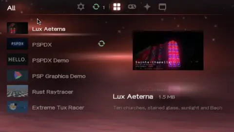

# PSPDX

**PSP Download Index**

Install and update homebrew directly on your PlayStation Portable, using the [PSPDX standard](https://chriopter.github.io/pspdx/).

**[→ Download PSPDX](https://github.com/chriopter/pspdx-app/releases/latest)**



## How to use

Just install, start and search for homebrew! Updates are shown automatically. Needs ARK-5 for WPA2.

Issues? [Tell us how it went](https://github.com/chriopter/pspdx-app/issues).

## How it works

- **The app** → browses catalogs, installs the release ZIP, checks for updates at start
- **The catalog** → many apps in one file, fetched in one request; [the main catalog](https://github.com/chriopter/pspdx-catalog) or your own
- **No catalog?** → every installed app keeps its `.pspdx` and asks its own repository

## The PSPDX standard

PSPDX uses the [PSPDX standard](https://chriopter.github.io/pspdx/) — its schemas and rules live in [chriopter/pspdx](https://github.com/chriopter/pspdx).

<details>
<summary><b>How PSPDX reads it</b> · ids, updates, lists</summary>

#### Derived, never written

- `id` → GitHub: `io.github.<owner>.<repo>`; elsewhere the host of `source` reversed, without `www.`, then the name; every part lowercased to `[a-z0-9]`; an `io.github.` id from anywhere but GitHub is refused
- A catalog's own `id` is kept only when it already is one (lowercase `[a-z0-9]` parts joined by dots, at most 159 bytes, `io.github.` only as the derived one) and doesn't clash with what's installed; anything else → the derived id
- `installdir` left out → `PSP/GAME/<repository name>` on GitHub, `PSP/GAME/<name>` elsewhere, cut to 32 allowed characters
- Update → the SHA-256 of `releases[0]` differs from the installed ZIP's; dates and version strings are not compared
- Readers ignore fields they don't know

#### Releases

- One published release, one `EBOOT.PBP` inside its ZIP; no manifest edit per release
- ZIP rule → one `.zip` on the release, or of several exactly one with `psp` in its name, any case; otherwise the app is left out with the reason
- `homebrew` installs under `PSP/GAME/`; `plugin` and `iso` are listed, not installed yet
- `size`, `sha256`, `eboot_md5` are never written by hand; the catalog computes them

#### Pinning a release

- No `release` → the newest GitHub release, with updates
- `"release": {"tag": "v1.2"}` → exactly that release, prereleases too; no updates until someone edits the file; a pinned app's catalog `releases` is that one release
- On GitHub → the tag must exist; `url`, if given, must be one of its assets, else the ZIP rule picks; `published_at` comes from GitHub, a value in the file is ignored
- Outside GitHub → `url` and `published_at` are required

#### No `.pspdx` in the repo

- A catalog can still list the app → PSPDX installs from its entry; the repo's 404 is all the PSP needs to know
- Updates keep coming from the catalog entry; the repo's own `.pspdx` wins as soon as it has one

#### Text list

```text
cache https://chriopter.github.io/pspdx-catalog/catalog.json
https://github.com/chriopter/pspdx-demo
https://github.com/someone/project@v1.2
```

- One repository URL per line; `@tag` pins a release
- `cache` names an aggregated catalog, read first; repos it doesn't cover are asked directly

#### Checking a `.pspdx` in VS Code

```json
"files.associations": { "*.pspdx": "json" },
"json.schemas": [{ "fileMatch": ["*.pspdx"],
  "url": "https://chriopter.github.io/pspdx/schema/pspdx-v1.json" }]
```

</details>

## Under the hood

<details>
<summary><b>Sources</b> · catalogs, repositories, INBOX</summary>

#### Where apps come from

| Source | Added through | Result |
|---|---|---|
| Catalog site URL, `catalog.json` or text list | **Add sources** | Browse all listed apps |
| GitHub URL or `owner/repo` | **Direct install** | Add the repository as a source and install its app |
| `.pspdx` files in `PSP/PSPDX/INBOX/` | **Direct install** | Validate and install the selected files |

- Preset sources, in this order: `https://chriopter.github.io/pspdx-catalog/`, `https://wijsman.de/psp-homebrew-database/`
- Presets ship as `PSP/GAME/PSPDX/presets.txt`, same lines as `sources.txt`; the EBOOT carries a copy for a stick without one
- Each preset lands once and is noted in `PSP/PSPDX/presets.seen`: removed stays removed, a new one in an update arrives
- A source that does not load is marked *unreachable* in the gear's list of catalogs; the rest load as usual
- A line ending in `.pspdx`, left from an older version, is skipped with a line in the log
- Sources are validated before they land in `PSP/PSPDX/sources.txt`
- Adding a catalog installs nothing; Direct install and INBOX do
- Removing a source keeps installed apps, their manifests and state

#### Presets

```text
start -> presets.txt (or the built-in list) -> in presets.seen? skip
                                            -> append to sources.txt unless there -> note in presets.seen
```

#### Reading a catalog site

```text
catalog.json  ->  ok: browse
   | fail
catalog.txt   ->  ok: check each listed repository directly
   | fail
saved copy    ->  ok: browse the last snapshot
```

A site with only `catalog.txt` works without a builder.

</details>

<details>
<summary><b>Install and update</b> · checks, recovery</summary>

#### Install

```text
x on app -> confirm -> repo's own .pspdx (404: the catalog entry)
         -> check source + installdir -> download release ZIP -> check size, SHA-256, ZIP, paths
         -> stage -> swap into PSP/GAME/<dir> -> write state
```

- Only the folder holding the single `EBOOT.PBP` is installed
- Installed from a catalog entry, the saved `.pspdx` is the entry's words; from outside GitHub the ZIP must match the entry's SHA-256
- An unmanaged folder in the way is never adopted or overwritten; PSPDX offers to move it to `<dir>.bak`
- A transaction journal covers files, manifest and state; an interrupted install recovers at the next start

#### Check

Runs at startup and on **Check for updates**, the top row of the stick tab.
An update is a newest release whose SHA-256 differs from the installed one.
Dates and version strings are not compared; a record from before SHA-256 was
kept falls back to a newer `published_at`.

**×** on **Check for updates** runs this; **□** runs it forced.

```text
1. Fetch every source in sources.txt.

2. For each installed app:
     in a catalog that answered and is under 24 h old?
       yes, not forced   ->  take the catalog entry, no GitHub request
       outside GitHub    ->  the catalog or the record, never GitHub
       otherwise         ->  step 3

3. Direct check due?
     due if forced, never asked, last answer came from a catalog,
     or the last direct answer is older than 6 h
       due               ->  .pspdx          raw.githubusercontent.com   no limit
                             latest release  api.github.com              1 of 60 an hour
       .pspdx is 404     ->  the catalog entry or the record stands; counts as asked
       not due           ->  the last answer saved in the record

4. releases[0] SHA-256 differs         ->  "Update to x.y"

5. Catalog older than 24 h             ->  the status line names its host
```

- A check against a maintained catalog is one request and no API call
- An app added by **Direct install** or from INBOX costs one API call, then none for six hours
- Only GitHub apps are asked directly; a repo without `.pspdx` costs one raw.githubusercontent.com request and no API call; an app from anywhere else updates through a catalog
- Nothing is topped up from GitHub: a `.pspdx` without author is by the account in its URL, a missing summary or licence stays empty

#### Apply

- Checking never installs; confirm an update with **×**
- **○** during download or unpack cancels the install and puts the stick back; in a batch it also stops the rest
- INBOX skips conflicts; only successful imports leave INBOX
- Self-updates run last; restart PSPDX afterward

#### Keys

**×** install, confirm · **△** options · **○** back · **□** basket · **START** run · **L/R** or **←/→** tabs

**△** → **Information**: version, author, licence, tags, size, id, last check, then summary and description; the **analog stick** scrolls, **○** back

</details>

<details>
<summary><b>Network</b> · HTTPS, TLS 1.3, offline</summary>

#### Requests

```text
catalog   ->  one request, gzip asked for, release data for every app
direct    ->  raw.githubusercontent.com   .pspdx, up to 16 KB
          ->  api.github.com              latest release
download  ->  release ZIP, following GitHub asset redirects
```

- First saved PSP network profile
- Everything over HTTPS
- Only a catalog asks for gzip, inflated as it arrives into a 512 KB buffer; `pspdx.log` says `fetch: <n> bytes gzipped, <m> inflated`. A ZIP is never asked for compressed
- TLS connections to the same host are briefly reused; a closed or expired one is reopened

#### TLS

- Not a perfect TLS 1.3, on purpose: a PSP has no trustworthy clock, no root store, no way to update either, and may have sat in a drawer for years. The goal is that it still connects, not maximum security
- Done by [pspkit-https](https://github.com/chriopter/pspkit-https): TLS 1.3 only, ChaCha20-Poly1305 first, all of Mozilla's roots, certificate dates held only against the day it was built. Its README says how and why
- An expired certificate, or one from an unknown issuer, asks "connect anyway?" instead of failing; a bad signature or the wrong hostname always fails
- The real guarantee: the ZIP you install is the one the catalog names (SHA-256), not that this connection is as safe as your browser's
- Packages are not signed; a catalog SHA-256 checks ZIP integrity, not author identity
- Seed: a sweep of the analog stick or smashed buttons when there is none yet, `CRYPTO/seed.bin` afterwards, renewed with Renew TLS Seed

#### Offline

- Refresh runs in the background; installing pauses network previews, they share the network stack
- Cached browsing works offline; release checks and downloads need a connection

</details>

<details>
<summary><b>Catalog</b> · updates, previews, cache, memory</summary>

#### What the builder does

```text
hourly:  repos.txt -> catalog.txt
         new release?  -> read .pspdx -> hash ZIP: the 20 newest release ZIPs, each hashed once
                       -> extract EBOOT media from the newest
         unchanged?    -> reuse the entry
         -> publish catalog.json
```

- `catalog.json` carries metadata, tags, description, source, install path, up to the 20 newest releases (date, ZIP URL, size, hash, changelog) and media URLs; the console reads `releases[0]`
- The reference builder lists repos with their own `.pspdx`, and a repo without one from a file in its `listed/`
- A push or manual run also picks up manifest-only edits; hourly runs wait for a release
- A build with no valid apps leaves the live site in place

#### How an update shows

- PSPDX compares the SHA-256 of the catalog's newest release with the installed one
- The catalog does not know what is on your PSP
- The update appears after the catalog publishes and the PSP refreshes; the ZIP still comes from the author's release

#### Previews

- The catalog hosts `ICON0.PNG`, `PIC1.PNG`, `ICON1.PMF` and `SND0.AT3` separately: no ZIP download for a preview; of several screenshots the first is shown
- Priority: installed EBOOT media -> cached or catalog media -> placeholder
- Direct GitHub lookups fetch no new previews

#### Cache

- Catalogs in `PSP/PSPDX/CACHE/catalogs/`, media in `CACHE/media/`
- Failed fetch: the last usable catalog stays for browsing; installed apps from GitHub ask their saved source, at most every six hours
- Offline: saved records and media only
- Both caches can be deleted without losing installation state

#### Memory

- Up to 64 apps in RAM; the catalog arrives in one 512 KB buffer
- A `.pspdx` (up to 16 KB) and a description sit on the heap, only for an app that has them
- **Information** breaks the description into lines once, when it opens, not every frame

</details>

<details>
<summary><b>Memory Stick</b> · manifests, state, cache</summary>

#### Layout

Example on the startup device (`ms0:` or `ef0:`); app IDs are illustrative.
Temporary and debug files appear only when used.

```text
ms0:/
└── PSP/
    ├── GAME/
    │   ├── PSPDX/                       # Downloader
    │   │   ├── EBOOT.PBP
    │   │   ├── .pspdx                   # Bundled for offline first start
    │   │   └── presets.txt              # Sources offered once
    │   ├── Cathedral/                   # Installed homebrew
    │   │   ├── EBOOT.PBP
    │   │   └── ...
    │   ├── .pspdx-stage/                # Temporary install
    │   ├── Cathedral.old/               # Rollback backup
    │   └── Cathedral.bak/               # Unmanaged folder moved aside
    └── PSPDX/
        ├── sources.txt                  # Subscriptions
        ├── presets.seen                 # Presets already offered
        ├── INBOX/demo.pspdx             # Awaiting import
        ├── INSTALLED/
        │   ├── io.github.chriopter.pspdxapp.pspdx
        │   ├── io.github.chriopter.pspdxapp.state.json
        │   ├── io.github.chriopter.pspcathedral.pspdx
        │   └── io.github.chriopter.pspcathedral.state.json
        ├── CACHE/
        │   ├── catalogs/<url-sha1>.json
        │   └── media/                   # Named after the served file
        │       ├── <app-id>-<file>.png
        │       ├── <app-id>-<file>.mp4      # or .pmf, as served
        │       └── <app-id>-<file>.at3
        ├── TMP/
        │   ├── download.zip
        │   └── transaction.json
        ├── LOGS/
        │   ├── pspdx.log
        │   └── http.txt
        ├── DEBUG/
        │   ├── PSPDX.BMP
        │   ├── PSPDX.KEYS
        │   ├── PSPDX.REPLAY
        │   ├── PSPDX.TRACE
        │   ├── PSPDX_REC/
        │   ├── font/ltn8.pgf
        │   └── ...
        └── CRYPTO/seed.bin
```

#### App state

`INSTALLED/<app-id>.pspdx` keeps the source independently of `sources.txt`;
for an app installed from a catalog entry, it is the entry's words.
`<app-id>.state.json` next to it has no outer app-ID key:

| Field | Contents |
|---|---|
| `source`, `added_from` | Original repository and import route |
| `installed` | Version, `published_at`, SHA-256, install directory |
| `latest` | Version, `published_at`, download URL, size, SHA-256, last successful check time and source |
| `update_check`, `manifest_url` | Written by older versions; read and ignored |

```text
install or update       ->  writes installed
catalog or GitHub check ->  writes latest, leaves installed alone
browse                  ->  writes nothing
```

- `installed 1.0` with `latest 1.1` means 1.0 is still installed
- PSPDX registers its own version at startup and copies its bundled `.pspdx`, no request needed
- `added_from` does not steer future checks; each operation writes only its app's state

#### Recovery and housekeeping

- Recoverable writes may leave `.new` or `.bak` files
- Staging and backup stay under `GAME/`: PSP renames need the same parent
- Keep `INSTALLED/`; `CACHE/` is disposable; never delete a pending transaction's files
- Only per-app state files load; older combined state files are ignored
- Corrupt records are preserved and block writes

</details>

## Development

<details>
<summary><b>Build and run</b> · Docker, PPSSPP</summary>

#### Build

Inside the `pspdev/pspdev:latest` container, or with `$PSPDEV`, cmake and
wget on the host:

```sh
git submodule update --init --recursive
sh app/lib/pspkit-https/tools/build-wolfssl
make -C app
```

- Output: `app/EBOOT.PBP`
- Libraries: pspkit-https (wolfSSL), cJSON, intraFont, libpng, zlib, PSP SDK
- CI builds inside `pspdev/pspdev:latest`

#### Run in the emulator

```text
dev/start             ->  build in Docker -> install on the PPSSPP stick -> launch
dev/start --no-build  ->  launch the existing build (a mock-catalog build is rebuilt anyway)
dev/start --mock      ->  the same against the local mock catalog
dev/release <version> [notes]  ->  clean master -> build -> pspdx.zip -> gh release
```

- Needs Linux, Docker, the PPSSPP Flatpak, Python, a systemd user session and Wayland; `dev/release` also `gh`
- `dev/start` installs `dev/ppsspp/controls.ini`

| PSP | Key |
|---|---|
| × ○ □ △ | S D A W |
| START, SELECT | Enter, Space |
| L, R | Q, E |
| d-pad | arrow keys |
| analog stick | I J K L |

</details>

<details>
<summary><b>Code layout</b> · app, dev, tools</summary>

| Location | Responsibility |
|---|---|
| `app/main.c` | Startup and the frame loop: the pad, the tabs and the cursor, the sync coming back, calls into `session/`, and the rig's hooks (scripted keys, screenshots, the film, the cipher benchmark) |
| `app/text.h` | Every word the screen shows, in one place |
| `app/gui/` | Browser, rendering, icons, previews and firmware keyboard |
| `app/gui/files_view.c` | Manage Data on screen: the two columns, the raw band, its keys, and the film or sound handed to the media thread |
| `app/session/view.c` | The browser's model, with nothing of the drawing in it: the tabs, the catalog filtered to the open one, the basket, what the action row would fetch, the gear's rows |
| `app/session/actions.c` | What the session does: installs, one or a run of them, removing, launching, fetching the catalog again, the sweep, the cache and the reset |
| `app/session/questions.c` | The questions that stand before those: put into words, and answered from the pad, X doing the thing and O leaving it |
| `app/session/options.c` | The one menu the shell draws: the package's options on triangle and the popups under the gear, their rows built and walked here |
| `app/update/` | Manifests, sources, catalogs, INBOX, media cache and synchronization |
| `app/install/` | ZIP reader, installation transactions and persistent app state |
| `app/network/` | The cipher benchmark the rig asks for |
| [`app/lib/pspkit-https/`](https://github.com/chriopter/pspkit-https) | HTTPS, the entropy pool and the sweep's stick step, as a submodule |
| `app/audio/`, `app/video/` | Audio and video playback |
| `app/util/` | Storage paths, PBP access and runtime helpers |
| `app/util/files.c` | What Manage Data reads off the stick: sources, installs, INBOX, the client's own files, filled into the view `gui/files_view.c` draws |
| `dev/tests/` | Host tests: the parsers, the records and the installer, with power cuts |
| `dev/` | Developing PSPDX: `start`, `release`, the mock catalog, the emulator settings, and the generators (`marks/`, `render-music.c`, `sweep-trace.py`) |
| `dev/rig` | The rig: one emulator run with scripted keys, leaving the log and screenshots |
| `dev/soak/` | Soak campaigns in the emulator, checked against a model of the client |
| `dev/localcat/` | The loopback catalog with its throwaway CA |
| `dev/testdata/` | Input traces for the entropy screen |
| `dev/tools/` | The EBOOT media scripts and the PSMF wrapper, for any PSP app's ICON1 and SND0 |

</details>

<details>
<summary><b>Tests</b> · host, emulator soak</summary>

#### Host tests

```sh
sh dev/tests/run
```

- Needs a C compiler, Python, cJSON, zlib and OpenSSL development files
- Runs the client code with address and undefined-behavior sanitizers
- A filesystem adapter simulates power cuts

#### Emulator soak

```sh
python3 dev/soak/run.py --runs 100 --seed 1
python3 dev/soak/run.py --perf 20
python3 dev/soak/run.py --edge 30
python3 dev/soak/scenarios.py --seed 1 --run 7   # print one input sequence
```

```text
mock catalog -> fixture build with a local CA -> scripted input in PPSSPP -> compare the stick with the model
```

- Needs Docker, the PPSSPP Flatpak and user systemd services
- Failures land under `dev/soak/results/`
- Fixture builds are for local testing only
- Neither replaces real PSP storage, WLAN and power-loss testing

</details>

<details>
<summary><b>Icons and EBOOT media</b> · glyphs, ICON1, SND0</summary>

From the repository root:

```sh
sh dev/marks/render.sh                                     # SVG -> PNG
python3 dev/marks/embed.py                                 # PNG -> app/gui/marks_data.h
sh dev/tools/eboot-media/make-icon1.sh demo.mp4 app/assets/icon1.pmf
sh dev/tools/eboot-media/make-snd0.sh theme.wav app/assets/snd0.at3
```

`dev/tools/` is for anyone packaging a PSP app, PSPDX included: the two scripts make the ICON1 and SND0 a PBP carries, and `dev/tools/mp4-to-psmf.c` wraps an MP4 the way the client does.

#### GUI glyphs

- Sources in `app/assets/marks/src/`
- Rendering needs `rsvg-convert` and ImageMagick; packing needs only Python
- SVGs, PNGs and the atlas header are committed, so normal builds need no graphics tools
- A new glyph needs matching entries in the generator's `ORDER` and `enum mark`

#### EBOOT media

| | Video (`ICON1.PMF`) | Audio (`SND0.AT3`) |
|---|---|---|
| Needs | ffmpeg, C compiler | ffmpeg, Python, `atracdenc` |
| Default | 6 s at 144×80 | 18 s ATRAC3 at 132 kbps |
| Knobs | `DURATION`, `FPS` | `DURATION`, `BITRATE` 132 or 66 |

Both scripts take a start offset as their third argument.

</details>

## Links

- [PSPDX Catalog](https://github.com/chriopter/pspdx-catalog) — the main catalog and its builder; [browse it](https://chriopter.github.io/pspdx-catalog/)
- [PSPDX standard](https://github.com/chriopter/pspdx) — the `.pspdx` and `catalog.json` schemas; [read them](https://chriopter.github.io/pspdx/)
- [Demo app](https://github.com/chriopter/pspdx-demo) — a complete homebrew with a `.pspdx`
- [Releases](https://github.com/chriopter/pspdx-app/releases/latest) — `pspdx.zip`

**Feedback is very welcome!**
